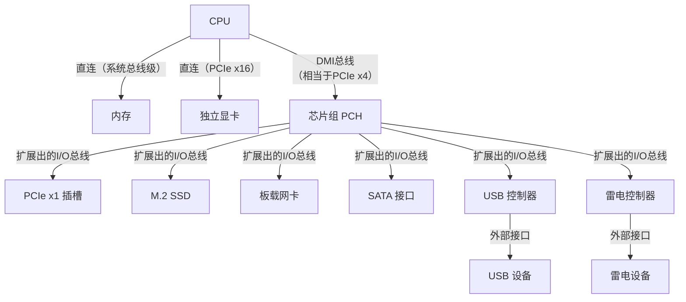

### 第四章 输入输出

* 计算机由互相连接的子系统构成
* I/O
* 总线在子系统间传输数据，进一步有层次化总线

**4.1 I/O基本原理**
(1)“外围”既用于描述外部设备又用于描述**外围设备的控制器**/接口(I/O控制器)(peripheral interface)，I/O控制器可视为一种协议转换器
(2)IO控制器与外围设备控制器在现代计算机的通用语境下，它们通常被当作同义词使用，但严格从计算机体系结构和历史演进来看，两者在侧重点和层次上有细微区别

* 早期计算机（分离时期）：
  * 区分很明显。计算机主板上会有独立的串口控制器、并口控制器卡，这些是标准的I/O控制器
  * 外接一个硬盘，硬盘盒子里面有自己的硬盘控制器。两者通过标准电缆（如IDE）连接
* 现代计算机（集成与融合）：
  * IO控制器集成在主板芯片组中：现代PC的南桥或Platform Controller Hub集成了多种I/O控制器（USB, SATA, PCIe等），它们直接是主板的一部分
  * 外围设备控制器集成在设备内部：现代的外围设备控制器功能极其强大。例如：
    * 一块固态硬盘，其内部的“主控”芯片既包含了与主机通信的I/O控制器功能（实现NVMe或SATA协议），也包含了闪存管理、磨损均衡等外围设备控制器的核心功能
    * 一张显卡，其GPU本身就是最复杂的外围设备控制器，但它通过PCIe总线与主机通信，这部分PCIe逻辑也可以看作是它的I/O控制器部分

* 在日常交流、编程(如驱动程序开发)或大多数计算机教材中，两者基本可以互换使用。​ 当你提到“设备控制器”时，通常指的就是这个负责与CPU交互、控制具体设备的硬件单元
* 在进行深入的体系结构讨论或设计硬件时，理解其区别是有意义的。I/O控制器更偏向“接口和通信管理”，而外围设备控制器更偏向“设备内部操作执行”
* 现代趋势是融合：一个高度集成的芯片（如SSD主控、网卡芯片）同时包含了完整的I/O控制和外围设备控制功能

(3)外部设备(外设)包含外部外设和内部外设

(4)两种**IO事务处理方案**(可混用)
* 专用IO体系结构(也称为端口映射I/O​ 或独立编址I/O):
  * CPU拥有一套完全独立于内存地址空间的I/O地址空间(即既有存储空间又有IO空间)
  * 访问内存和访问I/O设备使用的是不同的指令和不同的控制信号
* 内存映射IO(存储器映射IO):
  * I/O设备（如显卡、硬盘控制器）的寄存器被映射到普通的物理内存地址空间中
  * CPU访问这些设备寄存器，就像访问一个普通的内存位置一样，使用相同的加载/存储指令。它不需要IN/OUT这样的专用指令。访问I/O只是普通内存访问指令的一个“特殊目标地址”。因此，它不消耗额外的指令空间，把宝贵的操作码名额省下来用于其他更复杂的数据处理或控制指令
  * 存储器映射IO端口(外围接口芯片)可根据特定的应用配置成可以执行多种模式的操作，以覆盖大部分的市场需求

**4.1.1** 外围设备寄存器寻址机制
(1)可以一根地址线(R/~W)区分是只读寄存器还是只写寄存器，然后用另一根地址线区分只读(写)寄存器组中的两个寄存器，以此减少一根地址线的使用

(2)减少单独的可寻址寄存器的数量->减少与外围设备连接所需的引脚->减少成本(芯片封装与引脚数量对芯片成本有重要影响)
  * 外围设备接口有大量内部寄存器时：可使用两个可寻址寄存器来控制所有的内部访问，一个指针寄存器(偏移)和一个数据寄存器。基于指针寻址方式的一种变化涉及内部指针的自动递增，这对顺序访问寄存器时有帮助
  * 指针位：区分具有相同地址的寄存器

**4.1.2** 外围设备访问和总线宽度
(1)不同位数的外围设备和总线相连时出现存储端格式问题及映射问题

(2)有时候存储器访问的顺序很重要，比如在外设有自动复位状态寄存器或自动递增指针时，超标量处理器中以乱序方式存储数据到存储器会有影响。有一些同步指令保证操作的顺序执行

(3)副作用：有的指令会造成指令功能之外的效果，如有的指令是清除目标地址存储的数据，但它会先进行一次“假读”以选择寄存器，然后清除数据。一般来说读操作无害，但若是外围设备有读取后自动清除标志位的功能，此时和读取就会有害

**4.2 数据传输**

**4.2.1** 开环数据传输
(1)开环传输中，信息发出后即被视为能够正确接收，没有反馈来确认数据已经真正被接收。若外围设备处于离线、忙碌状态或速度很慢，数据有效信号(data avaliable,**DAV**)有效期间内数据可能还没被读取，因此开环传输又称为同步传输，因为接收数据的设备必须与发送数据的设备同步

**4.2.2** 闭环数据传输
(1)在开环传输的基础上加上了一个数据传输确认信号(data transfer acknowledge,**ACK**)以形成闭环

(2)完全互锁的握手协议

(3)数据发送端会在发出DAV信号时启动一个定时器，若经过一段时间后接收端没发出ACK信号，操作就会被中止，这个过程被称为超时(timeout)，超时后将产生中断，使计算机采取行动

**4.2.3** 缓冲数据
(1)外围设备可能使用的三种输入电路：不缓冲、单缓冲、双缓冲

(2)数据缓冲的更一般的解决方法是提供**先进先出(first-in-first-out,FIFO)的存储器**，它是一种可以植入任何微机或外围设备的内核的n级缓冲存储器。有空、部分填充、充满三个状态，可由输出标志来指示状态

(3)FIFO两种实现方法：基于寄存器的FIFO(移位寄存器)、基于RAM的FIFO(随机访问存储器)，定义FIFO的3个参数包括：宽度、深度、速度

* 基于寄存器的FIFO:深度较小时，成本较小，但深度大时需改为其它方案
* 基于RAM的FIFO中:读指针和写指针用于指示RAM中的数据。其相比于基于寄存器的FIFO的优势是通过空位置的时间为常数，与长度无关

(4)两种基于RAM的FIFO：同步、异步。移入、移出信号来源独立则为异步，反之为同步。常首选同步FIFO

(5)FIFO除了处理IO事务外，还能完成其它任务，比如连接两个不同宽度和端格式的系统并传输数据

**4.3 IO策略**
**4.3.1** 程序控制IO(programmed IO)
(1)在该方式中计算机会询问外围设备的状态寄存器，当外围设备就绪后进行处理。但由于处理器常处于轮询循环中，执行了很多无用指令，所以该方式因过于低效而未广泛采用

**4.3.2** 中断驱动IO(interrupt-driven IO)
(1)CPU检测**中断请求信号**(IRQ)为低电平，若中断信号没有被屏蔽，则响应中断请求。多数处理器有中断屏蔽寄存器，当CPU执行重要操作(如从系统故障中恢复、实时监测快速事件)时用于屏蔽优先级小于设定值的中断

(2)有时多个设备的IRQ信号被连接到一起，CPU无法定位发出中断请求的设备是哪个，此时会查询(polling)每个设备的状态寄存器来定位中断源。而中断查询机制提供的**中断优先级**(interrupt prioritization)会在查询时优先响应重要设备的中断请求

(3)每个存储器映射的外围设备具有一个**中断向量寄存器**(interrupt vector rigester,**IVR**)，用于告诉处理器如何找到合适的中断程序，通常IVR会提供一个中断向量表的指针

(4)处理器从接收到中断请求到响应中断的时间和称为**中断延迟**(interrupt latency)，在执行中断前会先执行完当前指令、保存状态信息(如程序计数器、处理器状态寄存器)，最后才会跳跃到中断子程序的位置开始执行程序

(5)不可屏蔽的中断请求(nonmaskable interrupt,**NMI**)，如掉电

(6)中断和异常
* CPU/硬件层面(狭义定义):中断和异常是并列关系，共同构成了CPU响应意外事件的机制
* 操作系统/软件层面(广义定义)：中断是异常的一个子类

(7)在CPU确定中断源前，它无法执行恰当的中断程序。所以有种机制是CPU检测到中断请求后，向可能发出中断请求的外设广播(broadcast)中断确认(interrupt acknowledge)，发出中断请求的设备返回一个中断向量让CPU调用

(8)ARM处理器中实现了一种快速中断请求模式，通过提供一组新寄存器以避免工作寄存器入栈、出栈的时间。由于实际中中断常由操作系统处理，所以中断时间开销会更大

**4.3.3** 直接存储器访问(direct memory access,**DMA**)
(1)此时外围设备和存储器间的数据传输不需要处理器干涉，而是使用自己的专用处理器来处理IO事务。DMA控制器(DMA controller,DMAC)控制的IO与多处理器系统没有本质区别，DMA与处理器相比还有在外围设备与存储器间拷贝数据块的指令集

(2)DMA控制器在传输数据前首先需要加载数据在存储器中的目标地址和传输的字节数，也就是说在启动DMA前要对其进行编程，而这在实践中由操作系统配置

**4.4 IO系统的性能**
(1)**CPU密集型**(CPU intensive)的计算机应用：需要更多的CPU时间和相对少的IO时间。与之相反的是**IO密集型**的应用

**4.5 总线**
(1)本地总线(CPU与本地存储器)、外围设备总线(外围设备与IO控制器)、系统总线(CPU、存储器、存储器映射的IO设备)

(2)**仲裁**(arbitration)：在有多个CPU的系统中(或至少一个设备可以像CPU一样启动数据传输动作)，总线决定在需要访问总线的设备中，哪个设备应该获得访问保障

(3)**总线主设备**(bus master)可以控制系统总线，**总线从设备**(bus slave)

(4)**即插即用**(pulg-and-play)：没有这个技术前，用户将新的外设与计算机相连时要了解物理连接、计算机及外设的硬件配置，自己指定外设的地址空间、中断请求号、DMA通道、握手机制等。而现在计算机与外设自动协议，将资源分配给外设并使资源不与其它外设的资源冲突

**4.5.1** 总线结构和拓扑
(1)总线的主设备不一定使用数据总线，可以只控制总线

(2)控制总线没精确定义，可以是读写数据时控制信息流动的信号，也可以是完成特定功能(如中断的控制和仲裁)的完整、单独的子总线

**4.5.2** 总线的结构
(1)任意时刻，只能有一个活跃的总线主设备，但可以有多个从设备。同时现代总线使用**分离事务**来提高呑吐率，使得在数据传输过程(一段时间内)中有多个主设备可以使用总线

(2)总线的发展
* PC扩展总线
  * 目标：提升带宽、降低延迟、即插即用、普及性
  * 8位数据通路->16位ISA->32位扩展工业标准体系结构(extended industry standard architecture,EISA)(较昂贵，不成功)->IBM微通道(要版权，昂贵)->VESA->Intel的64位外围组件互连总线(Peripheral Component Interconnect,PCI)->PCIe(PCI express)
* 工业/专业系统的总线(**背板总线**，backplane bus)：
  * 目标：高可靠性、强实时性、易于模块化维护与扩展、抗震动
  * VMEbus, multibus, Nubus, Futurebus+, CompactPCI, VPX
  * 物理实体：它就是一块结实的PCB板，上面布满了一系列完全相同的连接器插座，并通过精密的走线将这些插座的信号、电源、地址线等连接起来。它本身没有芯片，不处理数据，只负责数据传输和供电

(3)数据总线有宽度(一个**总线周期**内传输的比特数)、速度(由物理性质、连接总线的设备决定)、延迟(设置数据传输所花费的时间，若传输设备需等待总线仲裁则延迟会变长)3个参数。

(4)信号在总线上的传输速度由总线的电气特性(尺寸和导体周围物质的物理性质)决定，这使得数据从发送端到接收端有延迟，使用流水线技术可以减少这个延迟。

(5)从开路处返回的电流称为**反射**，电压为输入的两倍，其会发生在端点、总线间、总线与断点间有电阻改变的地方。其影响可以通过设计总线、合理的物理步局、采用吸收反射的终端设备来减小。如果负载(电阻)连接在总线的终点、负载的阻抗与总线的特性负载相同，就不会发生反射

(6)数据总线与地址总线可以并行工作(**非多路复用总线**)，也可以组合在一起形成多路复用的地址、数据总线(**多路复用总线**)(由于时间被划分为地址槽、数据槽，所以称为**时分多路复用**(time-division))。多路复用总线要比非多路复用总线慢，但成本更低。两种总线都可以通过**突发模式**提升效率，即提供一个地址，然后会传输该地址后面的一块数据而不用提供新的地址

(7)控制信号
* **数据方向信号**(data directional signal)数据方向信号由主设备指定。读与写信号可以有分别独立的通路，也可以复用一条通路，复用的优点是可以表示读、写、空闲三状态，不复用会有模糊状态(当为读信号时可能是读操作也可能是空闲状态)。
* **数据有效信号**(data valid signal,DAV)数据有效信号由主设备发出
* **数据选通信号**(data strobe,**DS**)与**数据选通确认信号**(**DSACK**)

**4.6 总线仲裁**

**4.6.1** **本地化仲裁**(localized arbitration)和**VMEbus**
(1)**总线请求者**(bus requester)由总线主设备(bus master)使用

(2)VMEbus通常在一个盒中，其上有几个插槽供模块插入，**仲裁者**(arbiter)位于插槽1。它是一种非复用、异步的背板总线，可通过多路复用模式使用地址总线使其从支持32位数据通路变为支持64位数据通路

(3)VMEbus的信号：
* 总线请求信号x(bus request,**BRx**)
* 总线清除(bus clear,**BCLR**)和总线忙(bus busy,**BBSY**)信号控制仲裁过程
* 总线允许输入信号x(bus grant in,**BGxIN**)和总线允许输出信号x(bus grant out,**BGxOUT**)：应答线，用于授予总线请求者总线控制权，它们构成**菊链**(daisy-chaining)

(4)

(5)主设备**释放总线**的两种方法：
* 用完释放(release when done,**RWD**)
* 根据请求释放(release on request,**ROR**)

(6)VMEbus的**仲裁算法**(下面为三种建议的策略)：
* RRS(round robin select,轮转选择)：公平算法
* PRI(prioritized,优先级)：贪婪算法
* SGL(single level,单级)：模块优先级仅由菊链决定

**4.6.2** **分布式仲裁**(distributed arbitration)

(1)**Nubus**
* 支持分布式仲裁、具有多路复用地址和数据线的通用同步背板总线
* 它不能支持超过16个插槽，每个插槽可以插一个卡(除了被保留的插槽)
* 每个卡都有一个唯一的空间片段，共同构成Nubus的地址空间，实现了**地理寻址**(graphic addressing)。32位的Nubus地址可以用十六进制$YXXXXXXX_{16}$表示，其中$Y$表示15个卡中的一个
* $Y=1111_{2}$对应的地址空间被保留并称为**槽空间**(slot space)，其被分为16个16MB的块，每个块与每个插槽相关联，即每个槽都有与之关联的唯一的16MB的地址空间
* 每个插槽有唯一的识别码$Y$(ID)，其由背板连接器本身决定。ID3~ID0信号不会沿着底板传输，而是简单地与地相连或与连接器的正极相连以提供插槽编号
* 有4个仲裁信号线**ARB**(ARB0~ARB3)，总线请求信号**RQST**

(2)**集电极开路门**(open-collector,**OC**)：用于允许多个设备来驱动相同的总线
* 输入为1时输出0，输入为0时为**悬浮状态**。即能把信号拉到低电平，但不能把信号拉到高电平
* 可以将多个OC门与一条总线连接，若所有OC门都处于悬浮状态，则总线也为悬浮态(实际中会外接上拉电阻将处于悬浮态的总线拉到高电平)；若有至少一个OC门进入0状态，总线将被迫进入0状态(称为**线或逻辑**(wired-OR logic)，可看作与门)
* 与三态门(**TS**)的区别：TS门无需外接器件，内部已集成

(3)分布仲裁机制：当一个输入$X$为1时，将使总线被迫为0，同时使其它$Y$为1。$Y$的输出为0，除非$X$的输入为1且总线被驱动为0

(4)

**4.7 PCI和PCIe总线**
**4.7.1** PCI总线
(1)外围组件互连局部总线(Peripheral Component Interconnect local bus,PCI bus)是PC扩展性和灵活性的核心，允许用户把卡插到计算机系统中，通过增加模块来增加功能。具体地，PCI允许这些卡利用**北桥**(North bridge)与CPU通信。**总线接口电路**总称**芯片组**(Chipset)，所有与PCI相连的PC都需要一个北桥芯片组

(2)“总线接口电路”指的是主板上用于连接不同总线(如连接CPU的前端总线、连接内存的内存总线、连接扩展卡的PCI总线)的物理电路和逻辑控制单元。这些接口电路被高度集成，做成了一组或几颗主要的芯片，这组芯片就被称为“芯片组”。
在早期的PC中，这些接口功能可能由许多分散的芯片完成。后来为了提升可靠性、减少主板面积和成本，英特尔等公司将**北桥**(Northbridge)和**南桥**(Southbridge)​这两大核心控制功能集成到两颗主要芯片中，形成了“芯片组”的概念。
* 北桥：高速枢纽，直接连接CPU、内存和高速显卡（AGP/PCI-E）
* 南桥：输入输出枢纽，连接PCI总线、硬盘（SATA/IDE）、USB、声卡等相对低速的设备

(3)北桥芯片(北桥是一个集成了内存控制器、高速图形接口以及传统PCI总线控制器的多功能芯片组。在现代计算机中，北桥的功能已被整合到CPU内部)：
* 前端总线：与CPU直接通信的高速通道
* 内存控制器：连接内存(如SDRAM、DDR)，负责所有内存访问请求
* 显卡接口：早期是AGP，后来演进为PCI Express x16，这是专为显卡设计的高速通道

(4)PC系统与PCI系统的核心概念与界定边界如下：
* **PC系统**​ 指完整的个人计算机系统，包括中央处理器(CPU)、内存、主板芯片组、存储设备、输入输出设备等所有硬件，以及操作系统和应用软件。它是一个完整的计算平台
* **PCI系统**​ 特指计算机内部基于PCI(Peripheral Component Interconnect，外围组件互连)总线标准构建的硬件子系统。它的核心是一个用于连接高速外部设备的并行总线结构，主要包括PCI总线本身、PCI插槽、与之连接的设备(如显卡、网卡)以及负责仲裁和管理总线访问的PCI控制器
* PC系统是“整台电脑”，而PCI系统是电脑里“用来插卡的那套标准和插槽”。在典型的PC架构中，PCI系统通过北桥(或现代CPU内的集成控制器)与CPU和内存连接，成为整个系统的一部分

(5)PCI通过北桥与PC相连，可以再通过其它第二个桥与其它总线相连，这使PCI可以支持旧的ISA总线

(6)与CPU直接连接的总线称为前端总线(front side bus)，PCI被称为本地总线(local bus)或局部总线

(7)根据**插槽**的宽度(32或64位)及电压水平(5V或更现代的3.3V电路)可将PCI连接器分成不同版本，PCI卡插入错误类型的插槽中可能损坏卡和主板，但32位的PCI卡可以完全兼容地插入64位的PCI插槽中，并且能够正常工作

(8)**PCI仲裁**过程：PCI卡的具有总线主设备功能的**代理**(agent)要向PCI总线提供**REQ**(请求总线)和**GNT**(从总线接收到允许)信号。北桥中的PCI仲裁者模块接收REQ信号，然后发出**BPRI**信号通知主处理器PCI代理需要总线，最后返回GNT信号给赢得仲裁的卡

(9)

**4.7.2** PCIe总线
(1)与PCI最大的区别是PCIe使用**串行传输**(serial transmission)，即实现点对点数据传输

(2)PCIe总线协议响应了ISO(国际标准化组织)的开放系统互连(open system interconnection,**OSI**)模型，层次化的优势是任意一层都可以在不影响其上下层的基础上被新技术替换
* OSI参考模型是一个理论框架，将网络通信抽象为7层(物理层、数据链路层、网络层、传输层、会话层、表示层、应用层)
* PCIe协议是一个具体的硬件互连标准，它将这个复杂模型精简并优化为3层(事务层、数据链路层、物理层)，以追求极高的效率和硬件实现的简便性
* PCI与PCIe的抽象体系结构：
  * PCI:软件(应用)->协议->信令->机械(插件和连接器)
  * PCIe:软件(应用)->事务层->数据链路层->物理层->机械(插件和连接器)

(3)一对差分线组成一个**Lane**(单向通道)。还可以实现多个通道，总线性能随着通道数量线性增长。单个通道的峰值数据传输率为每个方向250MB/s，若用户使用双向传输的x16通道系统(16条输入通道和16条输出通道)，则总的有效数据传输率为16*2*250=8GB/s

(4)两个数据传输技术：
* **差动传输**
  * 传统单端信号的问题：在普通数字电路中，一个信号线(相对“地”或“机壳”)的电压高低(如“>3.0V 为高，<0.3V 为低”)就代表“1”或“0”。这种信号容易受到外界的电磁干扰，导致电压瞬间波动，产生误判
  * 差动传输使用一对信号线来传输一个信号。信息不体现在单根线对地的电压上，而是体现在两根线之间的电压差上，这种信号形式被称为**低电压差分信息**(low voltage differential signaling,**LVDS**)
    * 当 A 线电压比 B 线高一个固定值(如 +V， -V)时，代表逻辑“1”
    * 当 B 线电压比 A 线高一个固定值(如 -V， +V)时，代表逻辑“0”
  * 当外界干扰(噪声)同时耦合到这一对紧挨着的信号线时，两根线上的电压会同时、同向、同幅度地波动。由于接收端只关心两者之间的差值，而这个差值在受到共模干扰时保持不变，因此信息不会出错
* **时钟恢复**
  * 针对高速串行传输的技术。当信号以$2.5\times10^9bit/s$以上的速度传输时，时钟信号的分布以及信号通过路径长度的不同导致的数据和时钟之间的延迟会被纳入考虑(时钟-数据间的延迟和**歪斜**问题)
  * 串行链路上传输的比特流的编码(如8b/10b编码)确保时钟信号被嵌入数据流，从而可以从数据流恢复时钟信号，同时不用再单独传输时钟信号
  * 接收端有一个叫“时钟数据恢复”的电路，它像锁相环一样，能从规律的数据跳变中，提取并重建出与数据完全同步的时钟信号

(5)串行传输与并行传输：
* 计算机与慢速外设之间一般用串行数据连接传输信息
* 总线的工作类似开线，数据沿着总线传输时辐射信息，也接收来自相邻总线连线上的信息(干扰)，在速度较高时，电磁干扰问题变得严重。并行总线中并行传输的导线越多，干扰越严重，而串行总线只要两条传输线，可减少干扰
* **数据扭曲**：在并行总线中，32位数据沿32条数据线传输给32个接收器，但这32位数据并不是在完全相同的时间到达目的，接收信号的时间范围就是数据扭曲。在高速环境下，需要复杂的设计技术和抗扭曲电路来处理该问题。而串行数据没有该问题(时钟和数据之间仍可能出现扭曲，但许多串行数据传输系统实现了有时钟恢复功能的串行数据编码以解决该问题)
* 并行总线本质是半双工的，每时刻只允许一个方向的传输，若要反向传输，则要时间逆转发送者和接收者。而串行总线中的串行通道也是半双工的，但可以提供两个通道来实现两个方向的传输，以实现全双工传输
* 并行总线数据传输协议和辅助功能(如仲裁和中断)需要复杂的控制结构，而串行总线不用额外的控制电路，所有功能都以串行信息传输

(6)通信领域中的概念:
* **半双工**、**全双工**和**单工**是通信技术中描述数据传输方向的术语，是通信信道的三种基本工作模式：
  * 单工 (Simplex)
定义：数据只能在一个方向上传输，就像单行道。
特点：通信双方的角色是固定的，一方永远是发送方，另一方永远是接收方，不能互换。
例子：传统的广播、电视信号。电视台只管发送信号，电视机只管接收，电视机无法向电视台发送数据。
  * 半双工 (Half-Duplex)
定义：数据可以在两个方向上传输，但不能同时进行。
特点：通信双方都可以发送和接收，但在同一时刻，只能有一方在发送，另一方在接收。就像对讲机，你说话时对方只能听，你说完“Over”后，对方才能开始说话。
例子：对讲机、早期的集线器(Hub)、Wi-Fi中的CSMA/CA机制。
  * 全双工 (Full-Duplex)
定义：数据可以在两个方向上同时传输。
特点：通信双方可以同时发送和接收数据，互不干扰。这通常需要两条独立的物理信道或技术手段来避免信号冲突。
例子：电话通话（你可以同时听对方说话和发表自己的意见）、现代以太网交换机、手机通话。
* **复用**：
  * 频分复用 (FDM)：按频率划分信道，如收音机不同电台
  * 时分复用 (TDM)：按时间片划分信道，如轮流发言
  * 波分复用 (WDM)：光纤中按光波波长划分
  * 码分复用 (CDM)：按编码区分信号，如3G网络

(7)**8b/10b编码**：
* 使用10位携带8位信息进行串行数据传输的方式，是相对现代的数据编码/解码机制，以冗余25%的代价提高了传输机制的性能，
* 使用运行偏差(Running Disparity)的机制，确保平均具有相同数量的1和0，这对于信号中没有直流分量的情形是必要的
* 将8位的字节分成3位和5位两组，3位的组成为4位的编码，5位的组成为6位的编码。8位字节对应256个有效代码，同时在10位编码中还有另外12个代码被保留以实现控制功能。10位的编码中不允许出现5个1和5个0、6个1和4个0、4个1和6个0以确保不会出现长串的1或0

(8)PCIe总线(或其它具有分层协议的串行总线和Internet)上**传输数据的格式**
* 从应用程序传出数据包，数据包被用分隔符包装并移交下一层，进行又一轮的包装，一次包装添加一个头部和尾部。反向传输时则是传递一层去除一次包装
* PCIe的消息结构：
  * 事务层(transaction layer)：头部定义了数据消息的性质(如数据的地址信息)，尾部为错误检测码(error-detecting code,ECRC)。事务层提供4个地址空间：存储器、I/O、配置和消息空间(message space)(执行控制功能的消息集合，即总线操作被指定的命令的编码，用来支持中断和复位等硬件管理，从而不采用专门的控制线路)
  * 数据链路层：头部包括来自事务层的帧的序号，尾部有一个循环冗余校验(cyclic redundancy check,CRC)。该层只有在知道有一个可接收报文的缓冲区时才发送报文以避免因丢包而重传

**4.7.3** CardBus、PC卡和ExpressCard
(1)Cardbus是用于笔记本电脑的一种扩展总线，允许插入体积小的模块至电脑，如微型硬盘、无线LAN适配器

(2)现代计算机(以x86架构为例)的总线层次可以概括为下图所示的架构，其核心是**CPU**与**芯片组（PCH）** 的分离与协作：

* 第一层：CPU内部总线
  *   **代表**：**Ring Bus**、**Mesh**、**Infinity Fabric**。
  *   **连接什么**：CPU内部的各个**核心**、**各级缓存**、以及**集成内存控制器**、**PCIe控制器**等。
  *   **特点**：速度极快，延迟极低，完全在CPU芯片内部，不对外开放。

* 第二层：系统总线/内存总线
  *   **代表**：**内存通道**、**直连PCIe通道**。
  *   **连接什么**：
      1.  **内存**：CPU通过集成内存控制器直接连接内存条，这是系统最重要的数据通道。
      2.  **高速外设**：CPU提供的**直连PCIe x16插槽**（通常用于独立显卡）和部分**直连M.2插槽**（用于NVMe SSD）。
  *   **特点**：这是CPU与外界交换数据的**最高速通道**，延迟低，带宽高。**这个层次的总线直接由CPU管理**。

* 第三层：I/O总线/扩展总线
  *   **代表**：**DMI总线**、**由芯片组扩展出的PCIe通道**。
  *   **连接什么**：所有其他标准I/O设备。CPU通过一条高速链路（如DMI，其本质是PCIe x4）连接到一个**芯片组**。芯片组再扩展出多条总线：
      *   更多的**PCIe x1/x4插槽**（用于声卡、采集卡等）。
      *   **SATA控制器**（连接SATA硬盘/光驱）。
      *   **USB主控制器**（连接所有USB设备）。
      *   **网络控制器**、**音频控制器**等。
  *   **特点**：这是一个**枢纽层**，负责聚合和管理大量中低速设备，将它们的数据整理后通过高速通道（DMI）与CPU通信。

* 第四层：外部接口总线
  *   **代表**：**USB**、**雷电**、**HDMI**、**DP**、**RJ-45网口**等。
  *   **连接什么**：真正的**外部设备**，如U盘、显示器、移动硬盘、网络。
  *   **特点**：这些是用户能直接看到的物理接口。它们**本身不是独立的总线层次**，而是**第三层I/O总线的物理出口和协议转换器**。例如，USB接口是USB控制器（在芯片组管理下）的物理表现。

---

### 回答你的具体问题

**1. 电脑外部扩展接口连接的总线是什么层次的？**
*   它们连接在**第三层（I/O总线/扩展总线）** 上。
*   例如，一个USB口，其信号最终通过主板上的USB控制器，汇入芯片组管理的PCIe总线，再经DMI总线到达CPU。
*   **历史上的CardBus/ExpressCard**：它们的目标是让笔记本能接入像PCI/PCIe这样的**系统级总线设备**。所以CardBus是**PCI总线（第二/三层）的延伸**；ExpressCard是**PCIe/USB总线（第二/三层）的延伸**。它们试图在外部接口上提供接近内部总线的性能。

**2. 背板总线（如VMEbus）是什么层次的？**
*   背板总线是**第二层（系统总线）和第三层（I/O总线）的融合体**，在它所在的专用系统中，它**承担了核心主干道的角色**。
*   在VMEbus系统中，CPU板、内存板、I/O板都插在同一个背板总线上，它们**平等地共享这条高速数据通道**，没有“CPU直连”和“芯片组转接”的明显区分。因此，它的定位更接近个人电脑中**CPU直连的PCIe总线**，但以模块化、坚固的形式呈现。

**4.8 SCSI和SAS接口**

**4.9 串行接口总线**
